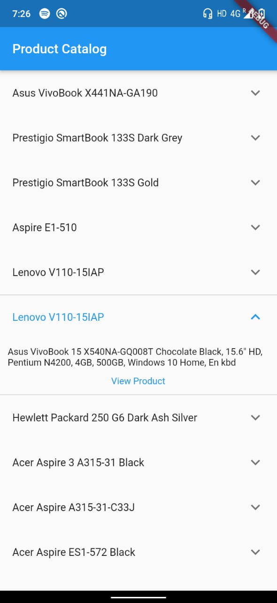

## A Simple Web Scraper for Dart & Flutter

A very basic web scraper implementation to scrap html elements from a web page.

Pull requests certainly welcome.

## Installation
Clone Repository and open in Android Studio:

Run `flutter pub get` in example directory

then,

`Read the comments to understand the basic implementation of the web_scraper`

## Example

This example scrapes the data from a website `https://webscraper.io` and  with a particular route and displays in form of expansion tiles. 
This example also uses `url_launcher` package to redirect default web browser.

## Contribute to the package at GitHub.
- File bugs, features, etc.
- Fix bugs and send pull requests
- Review pull requests